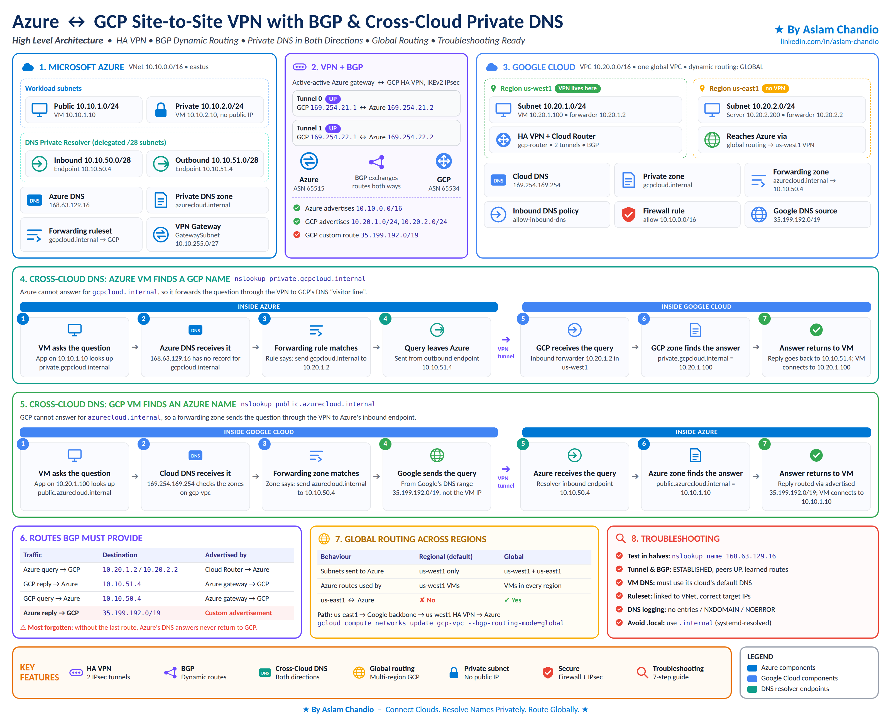
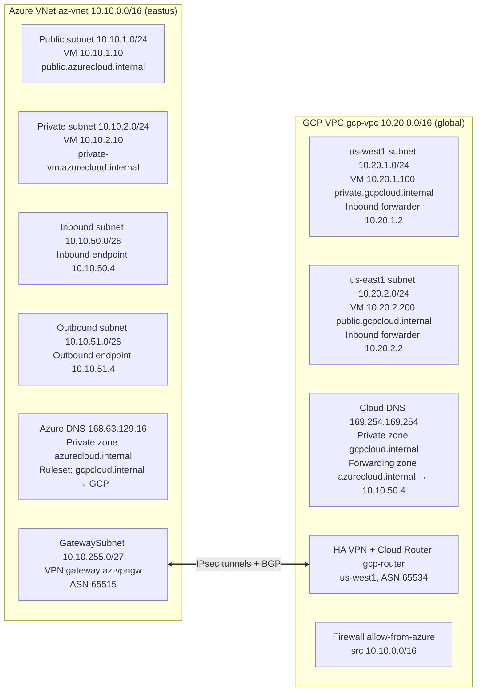
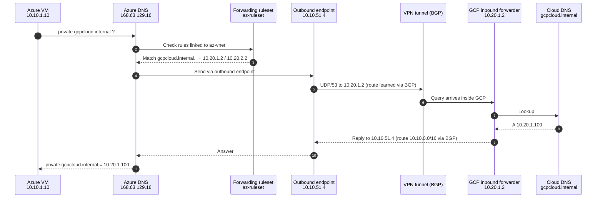
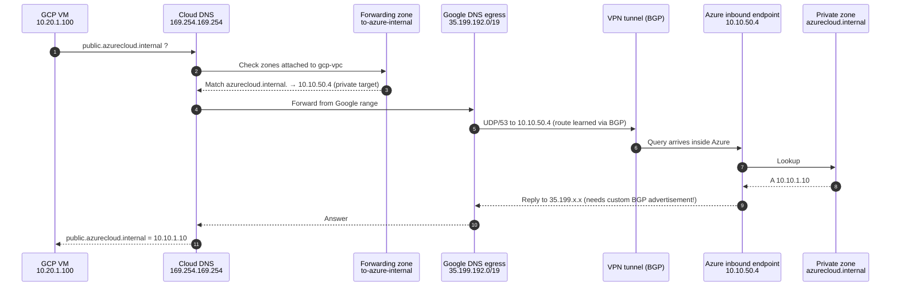
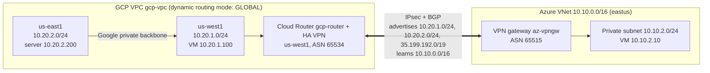
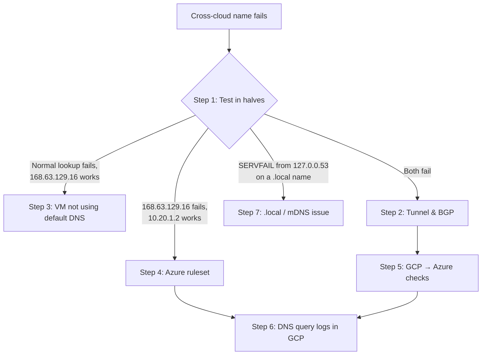

# ☁️ Azure ↔ GCP Site-to-Site VPN with BGP and Cross-Cloud Private DNS

<p>
  
  
  
  
  
</p>

🌐 **Multi-Cloud** · 🔐 **Private Networking** · 🔁 **BGP Dynamic Routing** · 🧭 **Cross-Cloud DNS** · 🛠️ **Troubleshooting Ready**

This guide explains how an **Azure VNet (`10.10.0.0/16`)** and a **GCP VPC (`10.20.0.0/16`)** are connected with a site-to-site IPsec VPN, how **BGP** automatically shares routes between them, and how virtual machines in each cloud find each other by **private DNS names** instead of IP addresses.

It uses **Azure DNS Private Resolver** (inbound subnet `10.10.50.0/28`, outbound subnet `10.10.51.0/28`) and **GCP Cloud DNS forwarding**, walks through every DNS lookup step by step with diagrams, and ends with a practical troubleshooting guide and all the Azure CLI and `gcloud` commands used.

👤 **Author:** Aslam Chandio<br>
🔗 **LinkedIn:** [linkedin.com/in/aslam-chandio](https://linkedin.com/in/aslam-chandio)

<a href="https://linkedin.com/in/aslam-chandio"></a>
<a href="https://github.com/aslamchandio"></a>

---

## Architecture



The diagram shows the whole solution on one page. Read it top to bottom:

| Panel | What it shows |
|---|---|
| **1. Microsoft Azure** | VNet `10.10.0.0/16` in `eastus`. **Workload subnets:** public `10.10.1.0/24` (VM `10.10.1.10`) and private `10.10.2.0/24` (VM `10.10.2.10`, no public IP). **DNS Private Resolver** in two delegated `/28` subnets: inbound endpoint `10.10.50.4` and outbound endpoint `10.10.51.4`. Also Azure DNS `168.63.129.16`, the private zone `azurecloud.internal`, the forwarding ruleset (`gcpcloud.internal → GCP`) and the VPN gateway in `GatewaySubnet 10.10.255.0/27`. |
| **2. VPN + BGP** | An **active-active Azure VPN gateway** connected to **GCP HA VPN** with two IKEv2 IPsec tunnels, both UP. BGP peers run over link-local addresses: Tunnel 0 `169.254.21.1 ↔ 169.254.21.2`, Tunnel 1 `169.254.22.1 ↔ 169.254.22.2`. Azure (ASN `65515`) advertises `10.10.0.0/16`; GCP (ASN `65534`) advertises `10.20.1.0/24`, `10.20.2.0/24` and the **custom route `35.199.192.0/19`**. |
| **3. Google Cloud** | One global VPC `10.20.0.0/16` with dynamic routing mode **GLOBAL**. **us-west1** (VPN region): subnet `10.20.1.0/24`, VM `10.20.1.100`, forwarder `10.20.1.2`, HA VPN and Cloud Router `gcp-router`. **us-east1** (no VPN): subnet `10.20.2.0/24`, server `10.20.2.200`, forwarder `10.20.2.2`; it reaches Azure through the us-west1 VPN via global routing. Shared services: Cloud DNS `169.254.169.254`, private zone `gcpcloud.internal`, forwarding zone `azurecloud.internal → 10.10.50.4`, inbound DNS policy `allow-inbound-dns`, firewall rule allowing `10.10.0.0/16`, and the Google DNS source range `35.199.192.0/19`. |
| **4. Azure VM → GCP name** | The 7 steps of `nslookup private.gcpcloud.internal` from Azure: the VM asks Azure DNS → the forwarding rule matches → the query leaves from the outbound endpoint `10.10.51.4` → crosses the VPN → GCP's inbound forwarder `10.20.1.2` answers `10.20.1.100` → the reply returns to the VM. Details in [section 3](#3-azure-vm-looks-up-a-gcp-name). |
| **5. GCP VM → Azure name** | The 7 steps of `nslookup public.azurecloud.internal` from GCP: the VM asks Cloud DNS → the forwarding zone matches → Google sends the query **from `35.199.192.0/19`** (not the VM IP) → crosses the VPN → Azure's inbound endpoint `10.10.50.4` answers `10.10.1.10` → the reply comes back via the advertised `35.199.192.0/19` route. Details in [section 4](#4-gcp-vm-looks-up-an-azure-name). |
| **6. Routes BGP must provide** | The four routes DNS forwarding needs in both directions. The red row, **Azure reply → GCP via `35.199.192.0/19`**, is the one most often forgotten. Without it, Azure's DNS answers never get back to GCP. Details in [section 5](#5-what-the-network-layer-must-provide). |
| **7. Global routing across regions** | Regional vs global dynamic routing mode. Only in **global** mode can `us-east1` reach Azure (path: us-east1 → Google backbone → us-west1 HA VPN → Azure). Enabled with `gcloud compute networks update gcp-vpc --bgp-routing-mode=global`. Details in [section 6](#6-global-routing-across-gcp-regions). |
| **8. Troubleshooting** | The short checklist: test in halves, check the tunnel and BGP, make sure VMs use their cloud's default DNS, check the ruleset link and targets, read DNS logs, and avoid `.local`. The full guide is in [section 8](#8-troubleshooting). |

**Key features:** HA VPN with 2 IPsec tunnels · BGP dynamic routes · cross-cloud DNS in both directions · multi-region GCP through global routing · private subnet with no public IP · firewall + IPsec security · 7-step troubleshooting guide.

**Legend:** dark blue = Azure components · light blue = Google Cloud components · teal = DNS resolver endpoints.

---

## Table of Contents

0. [Architecture](#architecture)
1. [A simple way to think about it](#1-a-simple-way-to-think-about-it)
2. [What lives where](#2-what-lives-where)
3. [Azure VM looks up a GCP name](#3-azure-vm-looks-up-a-gcp-name)
4. [GCP VM looks up an Azure name](#4-gcp-vm-looks-up-an-azure-name)
5. [What the network layer must provide](#5-what-the-network-layer-must-provide)
6. [Global routing across GCP regions](#6-global-routing-across-gcp-regions)
7. [Why each VM must use its default DNS](#7-why-each-vm-must-use-its-default-dns)
8. [Troubleshooting](#8-troubleshooting)
9. [Commands](#9-commands)
10. [Lessons learned](#10-lessons-learned)

---

## Quick Reference

| Item | Azure | GCP |
|---|---|---|
| Network | VNet `az-vnet` — `10.10.0.0/16` | VPC `gcp-vpc` — `10.20.0.0/16` |
| Region | `eastus` | `us-west1` (VPN), `us-east1` (extra subnet) |
| Built-in DNS | `168.63.129.16` | `169.254.169.254` |
| Private zone | `azurecloud.internal` | `gcpcloud.internal` |
| "Visitor line" (inbound) | Resolver inbound endpoint `10.10.50.4` | Inbound forwarders `10.20.1.2`, `10.20.2.2` |
| Outbound query source | Resolver outbound endpoint `10.10.51.x` | Google range `35.199.192.0/19` |
| VPN / BGP | VPN gateway `az-vpngw` (active-active), ASN `65515` | HA VPN + Cloud Router `gcp-router`, ASN `65534` |
| BGP peer IPs | Tunnel 0 `169.254.21.2`, Tunnel 1 `169.254.22.2` | Tunnel 0 `169.254.21.1`, Tunnel 1 `169.254.22.1` |
| Forwarding config | Ruleset `az-ruleset` → rule `to-gcp-internal` | Forwarding zone `to-azure-internal` |
| Resource group / project | `rg-s2s` | (your project) |

---

## 1. A simple way to think about it

Imagine each cloud is an **office** with its own **reception desk** (its built-in DNS). Each desk has a **phone book** for its own office only.

- When someone asks about a person in the *other* office, the desk has a **note** saying: *"For those names, call the other office's reception."*
- Each office also has a **visitor phone line** that the other office can call.
- The **VPN tunnel** is the private phone line between the two offices.

Everything in this document is just that idea, with real names and IP addresses.

| Analogy | Azure | GCP |
|---|---|---|
| Reception desk | Azure DNS `168.63.129.16` | Cloud DNS `169.254.169.254` |
| Phone book | Private DNS zone `azurecloud.internal` | Private zone `gcpcloud.internal` |
| Note on the desk | DNS forwarding ruleset | Forwarding zone |
| Visitor phone line | Inbound endpoint `10.10.50.4` | Inbound forwarder IPs `10.20.x.2` |
| Private phone line | IPsec VPN tunnel + BGP | IPsec VPN tunnel + BGP |

---

## 2. What lives where

**Diagram 1: Network layout of both clouds**



### Azure side (VNet `10.10.0.0/16`)

| Component | Address | Purpose |
|---|---|---|
| Public subnet | `10.10.1.0/24` | VMs that can have public IPs and internet access. Example VM `10.10.1.10` → `public.azurecloud.internal`. |
| Private subnet | `10.10.2.0/24` | Azure private subnet (no default outbound internet access). Example VM `10.10.2.10` → `private-vm.azurecloud.internal`. It is inside `10.10.0.0/16`, so it is reached over the VPN with no extra routing work. |
| Inbound subnet | `10.10.50.0/28` | Used only by the DNS resolver's **inbound endpoint** (`10.10.50.4`). Azure's *visitor phone line*: GCP sends its questions here. |
| Outbound subnet | `10.10.51.0/28` | Used only by the **outbound endpoint**. When Azure asks GCP something, the question leaves from here (e.g. `10.10.51.4`). |
| GatewaySubnet | `10.10.255.0/27` | Holds the Azure VPN gateway, which builds the tunnel to GCP and talks BGP using **ASN 65515**. |
| Azure DNS | `168.63.129.16` | The *reception desk*. Exists automatically in every VNet; every Azure VM uses it by default. |
| Private DNS zone | `azurecloud.internal` | Azure's *phone book*, e.g. `public.azurecloud.internal → 10.10.1.10`. Only works for VNets it is linked to. |
| Forwarding ruleset | `az-ruleset` | The *note on the desk*: "questions about `gcpcloud.internal`, send to GCP." |

> **Rules for the two resolver subnets**
> - They must be at least **`/28`** (16 addresses).
> - They must be **delegated to `Microsoft.Network/dnsResolvers`**, so nothing else (no VMs) can be placed in them.
> - Azure reserves the **first 4 addresses** of every subnet, so `.4` is the first usable IP. That is why the inbound endpoint is `10.10.50.4`.

### GCP side (VPC `10.20.0.0/16`)

| Component | Address | Purpose |
|---|---|---|
| Subnet `gcp-subnet-west` | `10.20.1.0/24` (`us-west1`) | Same region as the HA VPN and Cloud Router. Example VM `10.20.1.100` → `private.gcpcloud.internal`. |
| Subnet `gcp-subnet-east` | `10.20.2.0/24` (`us-east1`) | Different region from the VPN. Example server `10.20.2.200` → `public.gcpcloud.internal`. Reaches Azure only through **global routing** ([section 6](#6-global-routing-across-gcp-regions)). |
| Firewall rule `allow-from-azure` | src `10.10.0.0/16` | Allows traffic from Azure, including DNS queries from Azure's outbound endpoint. GCP firewall rules are global, so it covers both regions. |
| Inbound forwarder IPs | `10.20.1.2`, `10.20.2.2` | GCP's *visitor phone line*. GCP creates one automatically in each subnet when the inbound DNS policy is enabled. The `.2` values are examples — use the ones from `gcloud compute addresses list`. |
| HA VPN + Cloud Router | `us-west1` | The GCP end of the tunnel. Cloud Router talks BGP using **ASN 65534**. |
| Cloud DNS | `169.254.169.254` | GCP's *reception desk*, used by every GCP VM by default. |
| Private zone | `gcpcloud.internal` | GCP's *phone book*. |
| Forwarding zone | `to-azure-internal` | GCP's *note on the desk*: "questions about `azurecloud.internal`, send to Azure at `10.10.50.4`." |

### The tunnel in the middle

The VPN carries **all** traffic between `10.10.0.0/16` and `10.20.0.0/16`, including DNS. **BGP** is how each side learns which IP ranges are on the other side, so it knows to send packets into the tunnel.

---

## 3. Azure VM looks up a GCP name

What happens when the Azure VM runs `nslookup private.gcpcloud.internal`:

**Diagram 2: Azure → GCP name resolution**



1. **The Azure VM asks.** The app on `10.10.1.10` wants to reach `private.gcpcloud.internal`, so the VM sends the question to its reception desk, `168.63.129.16`.
2. **Azure DNS checks its notes.** It looks at the forwarding ruleset linked to this VNet.
3. **The rule matches.** The name ends in `gcpcloud.internal`, so the rule says "send this to GCP at `10.20.1.2` / `10.20.2.2`."
4. **The question leaves from the outbound subnet.** Azure sends it from the outbound endpoint (`10.10.51.4`). Azure knows how to reach `10.20.x.x` because GCP's Cloud Router told it via BGP, so the packet goes into the tunnel.
5. **GCP's visitor line picks up.** The inbound forwarder `10.20.1.2` (in `us-west1`, next to the VPN) receives the question as if it came from inside GCP.
6. **GCP checks its phone book.** Cloud DNS finds `private.gcpcloud.internal → 10.20.1.100`.
7. **The answer goes back.** GCP replies to `10.10.51.4`, which it can reach because Azure advertised `10.10.0.0/16` via BGP. Azure DNS hands the answer to the VM, and the VM connects to `10.20.1.100`.

---

## 4. GCP VM looks up an Azure name

What happens when the GCP VM runs `nslookup public.azurecloud.internal`:

**Diagram 3: GCP → Azure name resolution**



1. **The GCP VM asks.** The app on `10.20.1.100` wants `public.azurecloud.internal` and asks its reception desk, `169.254.169.254`.
2. **Cloud DNS checks its zones.** It looks at the zones attached to `gcp-vpc`.
3. **The forwarding zone matches.** The name ends in `azurecloud.internal`, so the forwarding zone says "send this to Azure at `10.10.50.4`."
4. **Google sends it from a special range.** GCP does **not** send the question from your VM's IP. It sends it from Google's own DNS range, **`35.199.192.0/19`**. The packet goes into the tunnel because GCP learned `10.10.0.0/16` from Azure via BGP.
5. **Azure's visitor line picks up.** The inbound endpoint `10.10.50.4` receives the question.
6. **Azure checks its phone book.** The private zone linked to the VNet has `public.azurecloud.internal → 10.10.1.10`.
7. **The answer goes back.** Azure replies to the `35.199.x.x` address. Azure only knows to send that reply into the tunnel because the **Cloud Router advertises `35.199.192.0/19` over BGP**. Without it, the reply would head toward the internet and be lost.

---

## 5. What the network layer must provide

DNS forwarding only works if **both directions** have routes, and BGP supplies all of them:

| Traffic | Destination | Who advertises the route |
|---|---|---|
| Azure query → GCP | GCP subnets (inbound forwarder IPs `10.20.1.2`, `10.20.2.2`) | GCP Cloud Router → Azure |
| GCP reply → Azure | Azure VNet (outbound endpoint IP `10.10.51.4`) | Azure VPN gateway → GCP |
| GCP query → Azure | Azure VNet (inbound endpoint IP `10.10.50.4`) | Azure VPN gateway → GCP |
| Azure reply → GCP | **`35.199.192.0/19`** | **GCP Cloud Router (custom advertisement) → Azure** |

> [!IMPORTANT]
> The last row is the one people most often forget. Without the custom advertisement of `35.199.192.0/19`, GCP's questions reach Azure, but Azure's answers never come back.

The GCP firewall rule that allows `10.10.0.0/16` covers Azure's outbound subnet `10.10.51.0/28`, so Azure's questions are let in.

---

## 6. Global routing across GCP regions

A GCP VPC is **global**: one VPC can have subnets in many regions. But the **Cloud Router is regional**. Ours lives in `us-west1`, next to the HA VPN and subnet `10.20.1.0/24`. So what happens to subnet `10.20.2.0/24` in `us-east1`, where there is no VPN?

**Diagram 4: One VPN in us-west1 serving a second GCP region (us-east1)**



The answer depends on one VPC setting: the **dynamic routing mode**.

- **Regional mode (default):** the Cloud Router only works for its own region. It tells Azure about `us-west1` subnets only (`10.20.1.0/24`), and the Azure routes it learns are only given to `us-west1` VMs. The `us-east1` subnet `10.20.2.0/24` is invisible to Azure, and its VMs cannot reach Azure.
- **Global mode:** the Cloud Router works for the whole VPC. It tells Azure about subnets in all regions (`10.20.1.0/24` and `10.20.2.0/24`), and gives the Azure routes to VMs in every region. Traffic from `us-east1` travels over Google's private backbone to `us-west1`, then through the VPN to Azure.

| Behaviour | Regional mode (default) | Global mode |
|---|---|---|
| Subnets advertised to Azure | Only `us-west1`: `10.20.1.0/24` | All regions: also `10.20.2.0/24` (`us-east1`) |
| Routes learned from Azure (`10.10.0.0/16`) | Used only by VMs in `us-west1` | Used by VMs in every region |
| `us-east1` server `10.20.2.200` reaches Azure `10.10.2.10` | ❌ No | ✅ Yes, through the `us-west1` tunnels |
| Azure reaches `10.20.2.200` | ❌ No | ✅ Yes |
| `us-east1` VM resolves `azurecloud.internal` | ❌ Fails (no route to `10.10.50.4`) | ✅ Works |
| Azure can use forwarder IP `10.20.2.2` | ❌ No | ✅ Yes |

### How a packet travels from us-east1 to Azure

1. The server `10.20.2.200` in `us-east1` sends a packet to `10.10.2.10`.
2. Its VPC route table has `10.10.0.0/16` (learned by the Cloud Router in `us-west1`, shared by global mode). The route points to the VPN tunnels.
3. Google carries the packet across its backbone from `us-east1` to `us-west1`. You don't configure this; it is automatic inside one VPC.
4. The packet enters the HA VPN tunnel in `us-west1` and arrives at the Azure VPN gateway.
5. Azure delivers it to `10.10.2.10` in the private subnet. The reply goes back the same way, because Azure learned `10.20.2.0/24` via BGP.

### What changes on the Azure side

Nothing extra is needed for `10.10.2.0/24`. The Azure VPN gateway advertises the whole VNet address space (`10.10.0.0/16`), which already includes the new subnet. VMs in the private subnet also use Azure DNS by default, and the forwarding ruleset is linked to the whole VNet, so they resolve `gcpcloud.internal` names immediately.

> Being a *private subnet* only removes default outbound internet access. It does **not** affect traffic over the VPN.

### What changes for DNS

- Cloud DNS zones belong to the **VPC, not a region**, so `us-east1` VMs can resolve `gcpcloud.internal` names in either mode.
- To resolve `azurecloud.internal`, Cloud DNS forwards to `10.10.50.4`. From `us-east1`, that only works in **global mode**, because the route to `10.10.0.0/16` must exist in that region. From `us-west1` (the VPN region), it works in both modes.
- The forwarder IP `10.20.2.2` lives in the `us-east1` subnet. Azure can only reach it in global mode, so **in regional mode the Azure rule should use `10.20.1.2` only**.
- GCP firewall rules are global, so the existing rule allowing `10.10.0.0/16` already covers `us-east1`.

### Trade-off to keep in mind

Azure is in `eastus`, but the VPN is in `us-west1`. So traffic from `us-east1` crosses the country **twice**: east coast → west coast (Google backbone) → back east to Azure. For production with heavy traffic from `us-east1`, add a **second HA VPN and Cloud Router in `us-east1`** for a much shorter path and extra redundancy. BGP will prefer the closer path automatically.

---

## 7. Why each VM must use its default DNS

Both flows start with the VM asking its cloud's built-in DNS (`168.63.129.16` on Azure, `169.254.169.254` on GCP). If a VM uses **any other DNS server**, it never reaches the ruleset or forwarding zone, so cross-cloud names fail.

That is also what happened with the earlier **`.local`** zones. Inside Linux, `systemd-resolved` refused to pass `.local` names to `168.63.129.16` at all, so step 1 of the Azure → GCP flow never happened. With **`.internal`**, the query flows normally from the VM into Azure DNS, and everything in the diagrams takes over from there.

---

## 8. Troubleshooting



### Step 1: Test in halves

Always start here — it tells you **which half** is broken.

```bash
# On an Azure VM: ask Azure DNS directly (skips the VM's own resolver)
nslookup private.gcpcloud.internal 168.63.129.16

# On an Azure VM: ask GCP's inbound forwarder directly (skips Azure DNS and the ruleset)
nslookup private.gcpcloud.internal 10.20.1.2

# On a GCP VM: ask Azure's inbound endpoint directly
nslookup public.azurecloud.internal 10.10.50.4
```

| Result | Where the problem is | Go to |
|---|---|---|
| Normal lookup fails, but `168.63.129.16` works | Inside the VM | [Step 3](#step-3-the-vm-is-not-using-its-default-dns) |
| `168.63.129.16` fails, but `10.20.1.2` works | Azure's ruleset | [Step 4](#step-4-azure--gcp-fails) |
| Both fail | Network or GCP | [Step 2](#step-2-check-the-tunnel-and-bgp), then [Step 5](#step-5-gcp--azure-fails) |

### Step 2: Check the tunnel and BGP

```bash
# GCP tunnel status (expect: ESTABLISHED)
gcloud compute vpn-tunnels describe tunnel-0 --region=us-west1 --format="value(status)"

# GCP BGP status (expect: peers UP and learned route 10.10.0.0/16)
gcloud compute routers get-status gcp-router --region=us-west1

# Azure connection status (expect: Connected)
az network vpn-connection show --resource-group rg-s2s --name conn-gcp-0 --query connectionStatus -o tsv

# Azure BGP peer status
az network vnet-gateway list-bgp-peer-status --resource-group rg-s2s --name az-vpngw -o table

# Azure learned routes (expect: 10.20.x.0/24 subnets AND 35.199.192.0/19)
az network vnet-gateway list-learned-routes --resource-group rg-s2s --name az-vpngw -o table
```

If `35.199.192.0/19` is missing, re-apply the custom advertisement:

```bash
gcloud compute routers update gcp-router --region=us-west1 \
  --advertisement-mode=custom \
  --set-advertisement-groups=all_subnets \
  --set-advertisement-ranges=35.199.192.0/19
```

If the inbound forwarder IPs are in more than one GCP region, make sure Azure can reach all of them:

```bash
gcloud compute networks update gcp-vpc --bgp-routing-mode=global
```

### Step 3: The VM is not using its default DNS

```bash
# Which DNS server does the Linux VM use? (should show 168.63.129.16 on Azure)
resolvectl status
ls -l /etc/resolv.conf

# Check for custom DNS on the Azure VNet and NIC (both should be empty)
az network vnet show --resource-group rg-s2s --name az-vnet --query dhcpOptions.dnsServers
az network nic show --resource-group rg-s2s --name <NIC_NAME> --query dnsSettings.dnsServers

# Clear them if needed, then restart the VM
az network vnet update --resource-group rg-s2s --name az-vnet --dns-servers ""
az network nic update --resource-group rg-s2s --name <NIC_NAME> --dns-servers ""
az vm restart --resource-group rg-s2s --name <VM_NAME>
```

If `/etc/resolv.conf` is a plain file instead of a symlink, restore the normal setup:

```bash
sudo ln -sf /run/systemd/resolve/stub-resolv.conf /etc/resolv.conf
sudo systemctl restart systemd-resolved

# Also check for DNS servers hard-coded in netplan
grep -r nameservers -A3 /etc/netplan/
```

### Step 4: Azure → GCP fails

```bash
# Is the ruleset linked to the VNet the VM is in?
az dns-resolver vnet-link list --resource-group rg-s2s --ruleset-name az-ruleset -o table

# Is the rule correct? Check:
#   - domain is "gcpcloud.internal." (with the trailing dot)
#   - state is Enabled
#   - target IPs match GCP's inbound forwarder IPs
az dns-resolver forwarding-rule show --resource-group rg-s2s --ruleset-name az-ruleset --name to-gcp-internal
gcloud compute addresses list --filter='purpose="DNS_RESOLVER"' --format="table(address,region,subnetwork)"

# Can the Azure VM reach port 53 on GCP?
nc -vz 10.20.1.2 53

# Is the inbound policy active, and does the record exist?
gcloud dns policies describe allow-inbound-dns
gcloud dns record-sets list --zone=gcpcloud-internal
```

> [!NOTE]
> Azure DNS briefly caches failed lookups (negative caching), so wait a few minutes after a fix before retesting.

### Step 5: GCP → Azure fails

```bash
# Is the forwarding zone pointing to 10.10.50.4 as a PRIVATE target?
gcloud dns managed-zones describe to-azure-internal

# Is the Azure inbound endpoint IP really 10.10.50.4?
az dns-resolver inbound-endpoint show --resource-group rg-s2s \
  --dns-resolver-name az-dns-resolver --name inbound-ep \
  --query "ipConfigurations[0].privateIpAddress" -o tsv

# Is the Azure private zone linked to the VNet, and does the record exist?
az network private-dns link vnet list --resource-group rg-s2s --zone-name azurecloud.internal -o table
az network private-dns record-set a list --resource-group rg-s2s --zone-name azurecloud.internal -o table
```

If all of these look right, the usual cause is a **missing `35.199.192.0/19` route in Azure** (see [Step 2](#step-2-check-the-tunnel-and-bgp)).

### Step 6: See whether queries reach GCP at all

Turn on DNS logging for the inbound policy, run the lookup from Azure again, then read the logs:

```bash
# Enable query logging on the inbound policy
gcloud dns policies update allow-inbound-dns --enable-logging

# Read recent DNS query logs
gcloud logging read 'resource.type="dns_query"' --limit=20 \
  --format="table(timestamp,jsonPayload.queryName,jsonPayload.sourceIP,jsonPayload.responseCode)"
```

| Log result | Meaning | Next check |
|---|---|---|
| No entries | Query never reached GCP | Azure (Steps 3 & 4) or routing (Step 2) |
| `NXDOMAIN` | Query arrived, name not found | Record and zone name |
| `NOERROR` | GCP answered; reply lost on the way back | GCP learned `10.10.0.0/16`? (Step 2) |

### Step 7: SERVFAIL from 127.0.0.53 on a `.local` name

If a zone ends in `.local`, Linux `systemd-resolved` treats it as **multicast DNS** and never sends it to Azure DNS. You'll see `SERVFAIL` from `127.0.0.53`, even though `nslookup <name> 168.63.129.16` works.

The best fix is to **rename the zone to `.internal`**. As a quick workaround on one VM:

```bash
# Route .local queries to the unicast DNS server on eth0
sudo resolvectl domain eth0 '~local'
```

---

## 9. Commands

### Azure: resolver subnets and endpoints

```bash
# Get the VNet ID (use it as <VNET_ID> below)
az network vnet show --resource-group rg-s2s --name az-vnet --query id -o tsv

# Create the inbound subnet (delegated to DNS resolvers)
az network vnet subnet create --resource-group rg-s2s --vnet-name az-vnet \
  --name snet-dns-inbound --address-prefixes 10.10.50.0/28 \
  --delegations Microsoft.Network/dnsResolvers

# Create the outbound subnet (delegated to DNS resolvers)
az network vnet subnet create --resource-group rg-s2s --vnet-name az-vnet \
  --name snet-dns-outbound --address-prefixes 10.10.51.0/28 \
  --delegations Microsoft.Network/dnsResolvers

# Create the DNS Private Resolver
az dns-resolver create --resource-group rg-s2s --name az-dns-resolver \
  --location eastus --id "<VNET_ID>"

# Create the inbound endpoint with the fixed IP 10.10.50.4
az dns-resolver inbound-endpoint create --resource-group rg-s2s \
  --dns-resolver-name az-dns-resolver --name inbound-ep --location eastus \
  --ip-configurations "[{private-ip-address:'10.10.50.4',private-ip-allocation-method:'Static',id:'<VNET_ID>/subnets/snet-dns-inbound'}]"

# Create the outbound endpoint
az dns-resolver outbound-endpoint create --resource-group rg-s2s \
  --dns-resolver-name az-dns-resolver --name outbound-ep --location eastus \
  --id "<VNET_ID>/subnets/snet-dns-outbound"
```

### Azure: private zone, ruleset and rule

```bash
# Private zone + VNet link + A record
az network private-dns zone create --resource-group rg-s2s --name azurecloud.internal
az network private-dns link vnet create --resource-group rg-s2s --zone-name azurecloud.internal \
  --name link-az-vnet --virtual-network az-vnet --registration-enabled false
az network private-dns record-set a add-record --resource-group rg-s2s --zone-name azurecloud.internal \
  --record-set-name public --ipv4-address 10.10.1.10

# Get the outbound endpoint ID (use it as <OUTBOUND_EP_ID>)
az dns-resolver outbound-endpoint show --resource-group rg-s2s \
  --dns-resolver-name az-dns-resolver --name outbound-ep --query id -o tsv

# Forwarding ruleset attached to the outbound endpoint
az dns-resolver forwarding-ruleset create --resource-group rg-s2s --name az-ruleset \
  --location eastus --outbound-endpoints "[{id:'<OUTBOUND_EP_ID>'}]"

# Rule: gcpcloud.internal. → GCP inbound forwarders
az dns-resolver forwarding-rule create --resource-group rg-s2s --ruleset-name az-ruleset \
  --name to-gcp-internal --domain-name "gcpcloud.internal." --forwarding-rule-state Enabled \
  --target-dns-servers "[{ip-address:'10.20.1.2',port:53},{ip-address:'10.20.2.2',port:53}]"

# Link the ruleset to the VNet
az dns-resolver vnet-link create --resource-group rg-s2s --ruleset-name az-ruleset \
  --name link-az-vnet --id "<VNET_ID>"
```

### GCP: private zone, inbound policy, forwarding zone, route advertisement

```bash
# Private zone + records
gcloud dns managed-zones create gcpcloud-internal --dns-name="gcpcloud.internal." \
  --visibility=private --networks=gcp-vpc --description="GCP private zone"
gcloud dns record-sets create private.gcpcloud.internal. --zone=gcpcloud-internal \
  --type=A --ttl=300 --rrdatas=10.20.1.100
gcloud dns record-sets create public.gcpcloud.internal. --zone=gcpcloud-internal \
  --type=A --ttl=300 --rrdatas=10.20.2.200

# Inbound server policy (creates one forwarder IP per subnet)
gcloud dns policies create allow-inbound-dns --networks=gcp-vpc \
  --enable-inbound-forwarding --description="Allow Azure to query Cloud DNS"

# Get the inbound forwarder IPs (use these in the Azure forwarding rule)
gcloud compute addresses list --filter='purpose="DNS_RESOLVER"' \
  --format="table(address,region,subnetwork)"

# Forwarding zone: azurecloud.internal. → Azure inbound endpoint (private routing via VPN)
gcloud dns managed-zones create to-azure-internal --dns-name="azurecloud.internal." \
  --visibility=private --networks=gcp-vpc --private-forwarding-targets=10.10.50.4 \
  --description="Forward to Azure Private Resolver"

# Advertise all subnets + Google's DNS forwarding range to Azure
gcloud compute routers update gcp-router --region=us-west1 \
  --advertisement-mode=custom \
  --set-advertisement-groups=all_subnets \
  --set-advertisement-ranges=35.199.192.0/19
```

### New subnets and global routing

```bash
# Azure: create the private subnet (no default outbound internet access)
az network vnet subnet create --resource-group rg-s2s --vnet-name az-vnet \
  --name snet-private --address-prefixes 10.10.2.0/24 --default-outbound false
az network private-dns record-set a add-record --resource-group rg-s2s --zone-name azurecloud.internal \
  --record-set-name private-vm --ipv4-address 10.10.2.10

# GCP: create the two subnets, one per region
gcloud compute networks subnets create gcp-subnet-west --network=gcp-vpc --region=us-west1 --range=10.20.1.0/24
gcloud compute networks subnets create gcp-subnet-east --network=gcp-vpc --region=us-east1 --range=10.20.2.0/24

# GCP: turn on global routing, then confirm it says GLOBAL
gcloud compute networks update gcp-vpc --bgp-routing-mode=global
gcloud compute networks describe gcp-vpc --format="value(routingConfig.routingMode)"

# Check the inbound forwarder IPs (one per subnet: 10.20.1.x in us-west1, 10.20.2.x in us-east1)
gcloud compute addresses list --filter='purpose="DNS_RESOLVER"' \
  --format="table(address,region,subnetwork)"

# Confirm Azure now learns both 10.20.1.0/24 and 10.20.2.0/24
az network vnet-gateway list-learned-routes --resource-group rg-s2s --name az-vpngw -o table

# From a VM in us-east1 (the region without the VPN)
nslookup private-vm.azurecloud.internal
ping 10.10.2.10
```

### Verify

```bash
# Routes and BGP on both sides
az network vnet-gateway list-learned-routes --resource-group rg-s2s --name az-vpngw -o table
gcloud compute routers get-status gcp-router --region=us-west1

# From an Azure VM
nslookup private.gcpcloud.internal

# From a GCP VM
nslookup public.azurecloud.internal
```

---

## 10. Lessons learned

- **Each VM must use its cloud's built-in DNS** (`168.63.129.16` on Azure, `169.254.169.254` on GCP). If a VM uses any other DNS server, it never reaches the ruleset or forwarding zone, so cross-cloud names fail.
- **Avoid `.local` for private zones.** On Linux, `systemd-resolved` (`127.0.0.53`) reserves `.local` for multicast DNS and never forwards those names to Azure DNS, which causes `SERVFAIL`. Use **`.internal`**, which is officially reserved for private networks.
- **Advertise `35.199.192.0/19` from the Cloud Router.** Without it, Azure cannot send answers back to GCP's forwarded queries.
- **Use `--private-forwarding-targets`** on the GCP forwarding zone so queries go through the VPN, not the internet.
- **Turn on global routing for multi-region GCP.** With one VPN in `us-west1`, subnets in other regions (like `10.20.2.0/24` in `us-east1`) can only reach Azure, and resolve Azure names, when the VPC uses `--bgp-routing-mode=global`.
- **Test in halves.** `nslookup <name> 168.63.129.16` on an Azure VM bypasses the VM's own resolver and shows whether the cloud side is working.

---

<div align="center">

👤 **Author:** Aslam Chandio<br>
🔗 **LinkedIn:** [linkedin.com/in/aslam-chandio](https://linkedin.com/in/aslam-chandio)

<a href="https://linkedin.com/in/aslam-chandio"></a>

⭐ *If this guide helped you, please star the repo!* ⭐

</div>
